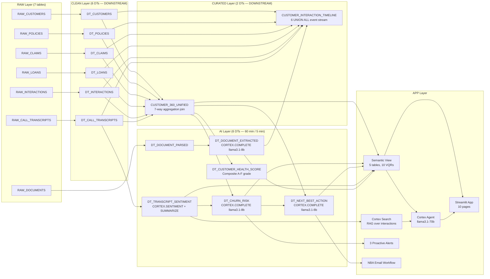
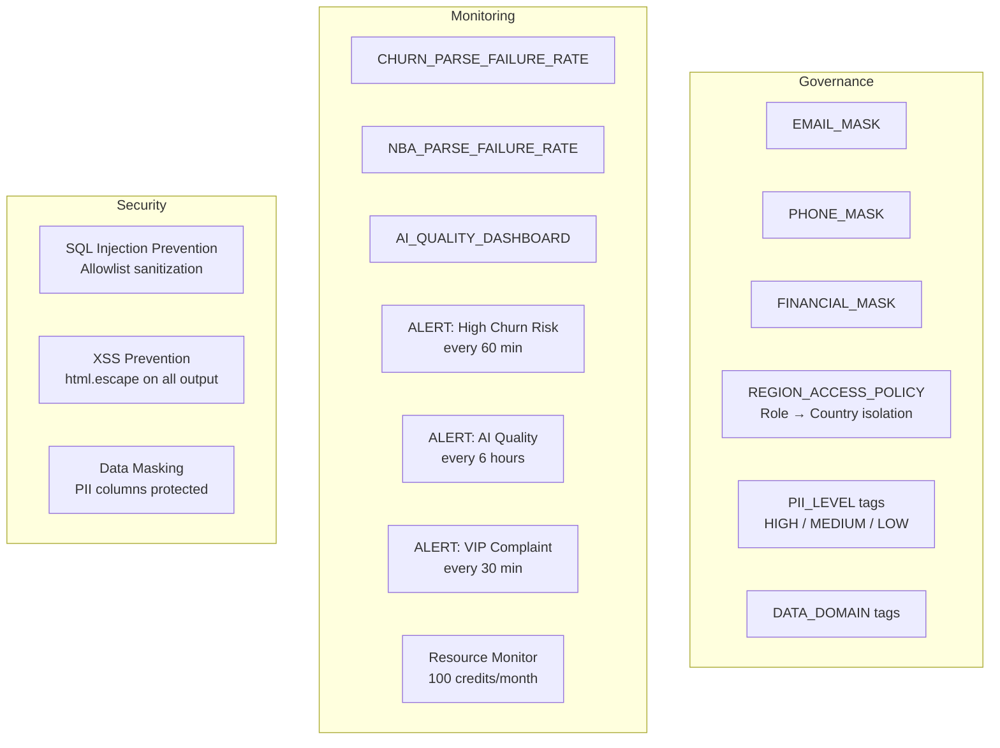

# Architecture

## Data Pipeline

## Security & Governance

## Cortex AI Functions Used

| Function | Where Used | Purpose |
|----------|-----------|---------|
| `CORTEX.SENTIMENT` | DT_TRANSCRIPT_SENTIMENT | Score call transcripts (-1 to 1) |
| `CORTEX.SUMMARIZE` | DT_TRANSCRIPT_SENTIMENT | Generate 2-3 sentence call summaries |
| `CORTEX.COMPLETE` | DT_CHURN_RISK | Predict churn risk (0-1) with risk factors |
| `CORTEX.COMPLETE` | DT_NEXT_BEST_ACTION | Recommend retention actions |
| `CORTEX.COMPLETE` | DT_DOCUMENT_EXTRACTED | Extract structured fields from documents |
| `CORTEX.COMPLETE` | SP_SEND_NBA_EMAILS | Generate personalized retention emails |
| `CORTEX.COMPLETE` | What-If Simulator | Predict churn under modified conditions |
| `CORTEX.COMPLETE` | AI Advisor (5_AI_Advisor.py) | Conversational customer intelligence |
| `CORTEX.TRANSLATE` | CUSTOMER_SUMMARY_TRANSLATED | Multilingual customer summaries |
| Cortex Search | INTERACTION_SEARCH_SERVICE | Semantic search over interactions |
| Cortex Agent | CUSTOMER_360_AGENT | Orchestrated multi-tool AI advisor |
